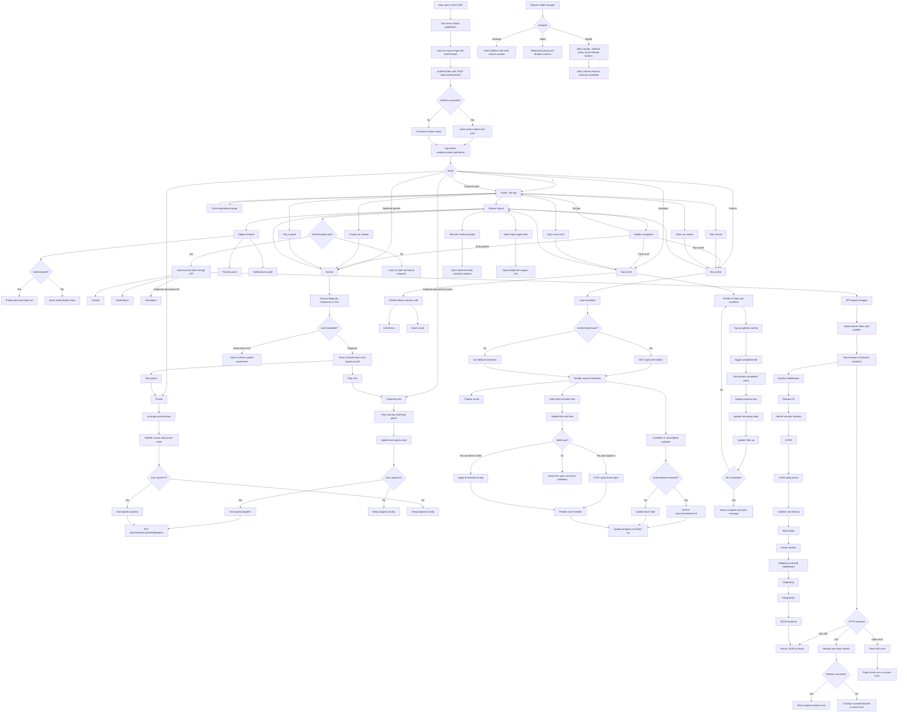
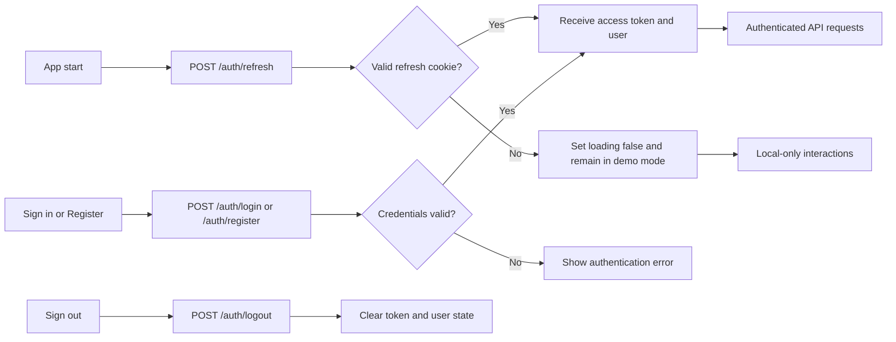

# Smriti web application workflow

This diagram describes the current application flow from browser startup through navigation, authentication, page interactions, API calls, and responsive support controls.

## Complete application flow

## Page-level interaction summary

| Area | Main user actions | State or persistence |
| --- | --- | --- |
| My day | Choose routine, games, or care circle; cycle quote | Navigation and quote are local UI state |
| Brain games | Select level; open Colourful pairs or Jigsaw puzzle | Game state is local; signed-in progress can be saved |
| My routine | Complete reminders, choose mood, add reminders | Demo mode is local; signed-in reminders use the API |
| Care circle | Call Meera, send note, complete nine care steps | Completion state is local to the page session |
| Friends | Search connected friends | Loaded from `/friends` for authenticated users |
| Notifications | Accept or decline friend request | Current request decision is local UI state |
| Profile | View profile or sign out | Authentication context and `/auth/logout` |
| Need Help | Open telephone support | External device/browser telephone action |
| Talk with Smriti | Open assistant | External assistant window |

## Authentication flow

## Error and fallback paths

1. An unavailable refresh request does not block the interface; the application remains usable in demo mode.
2. A protected API request receiving `401` tries one refresh request and then retries the original request once.
3. Failed reminder synchronization is shown through the routine page error state.
4. Unknown client-side paths fall back to the My day view.
5. Empty friends or notifications responses render friendly empty states.
6. Narrow screens use the menu button and stacked layouts instead of horizontal scrolling.

